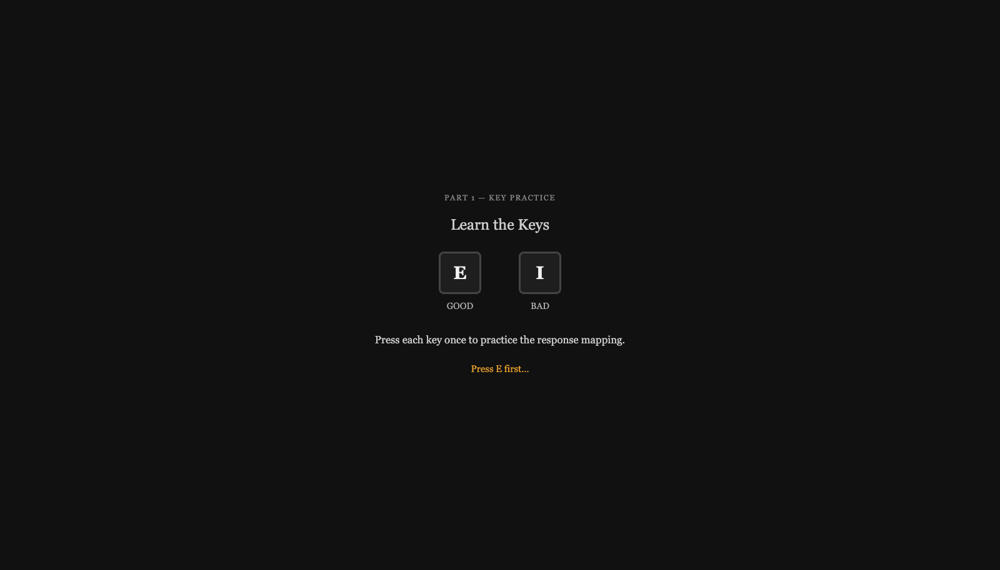
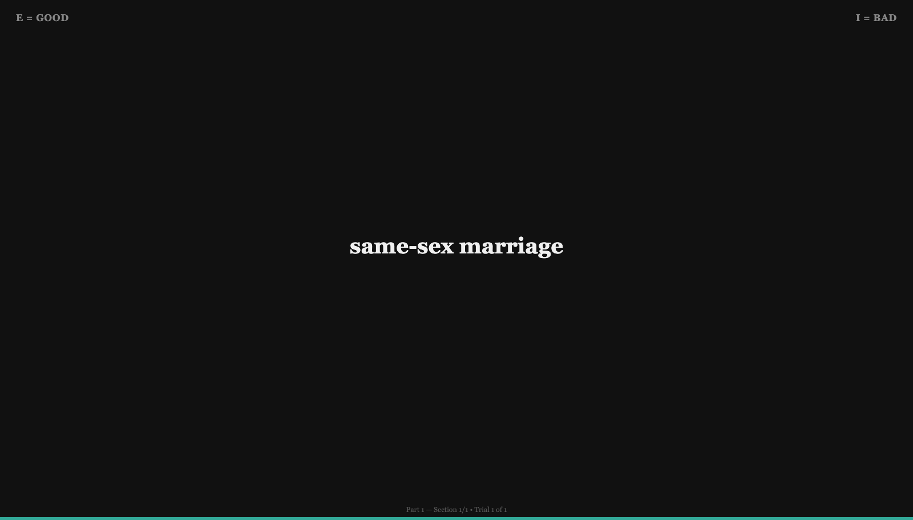
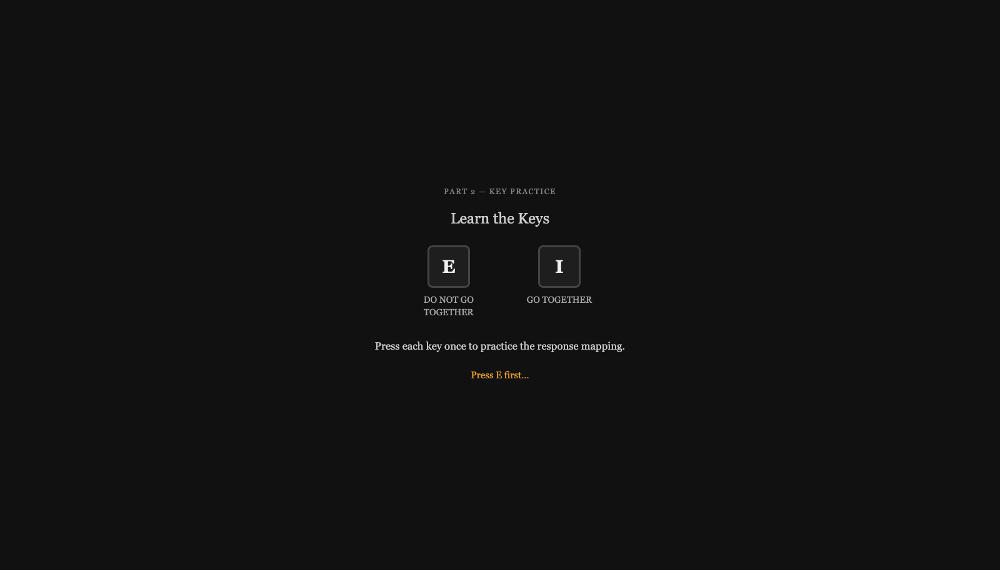
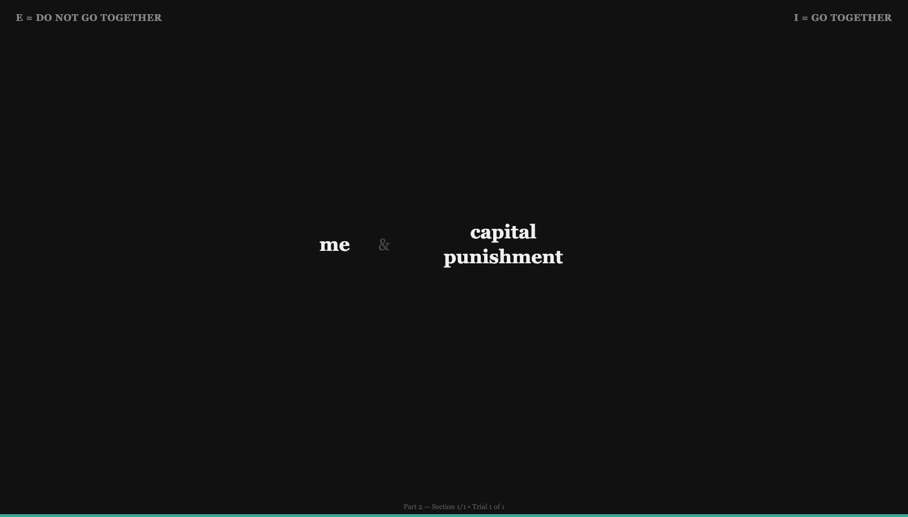
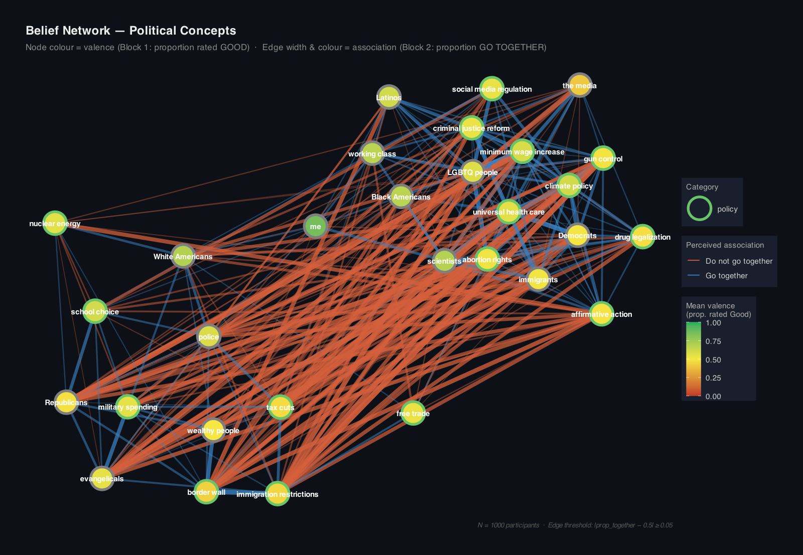
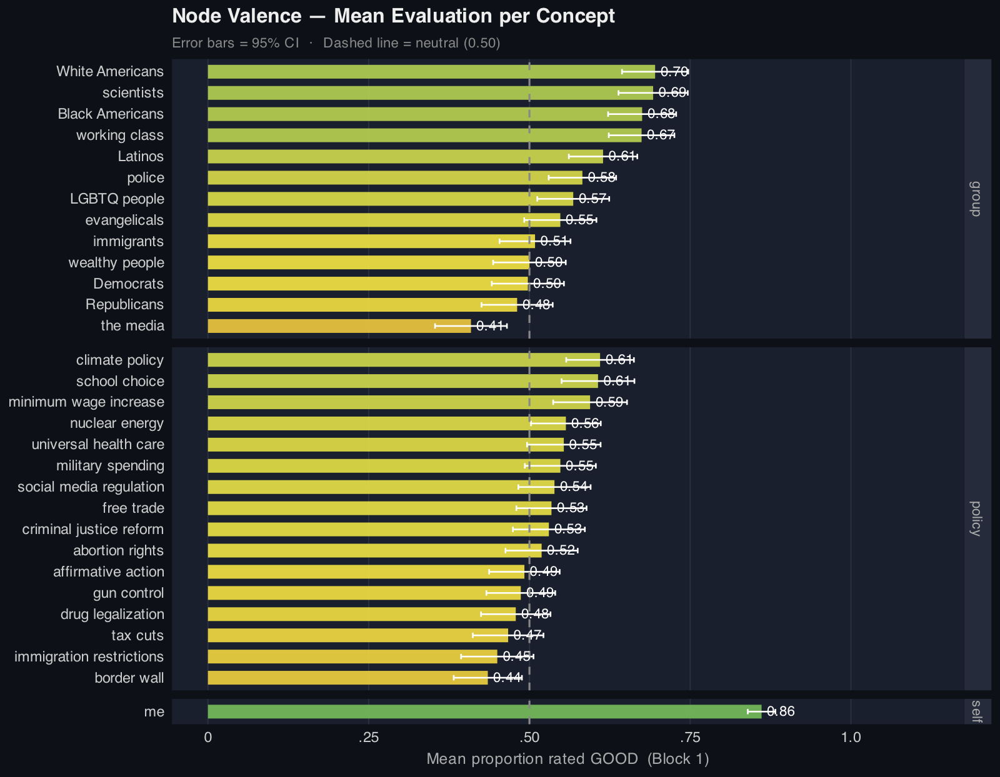
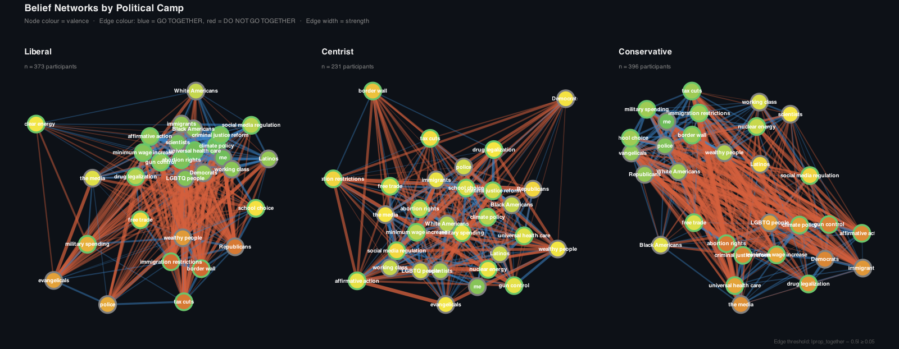
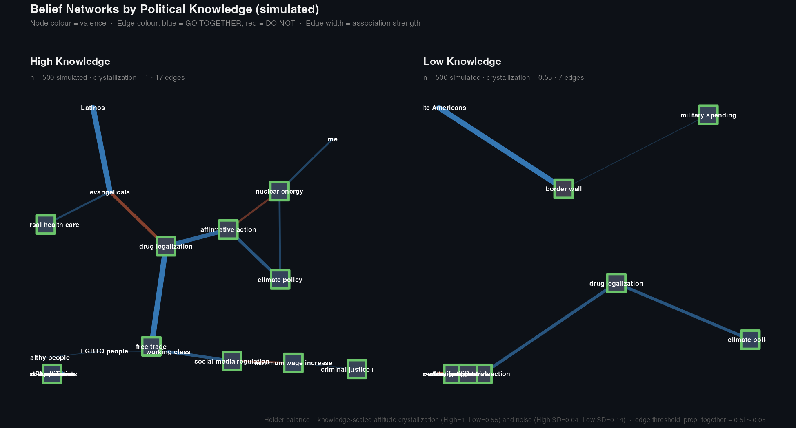
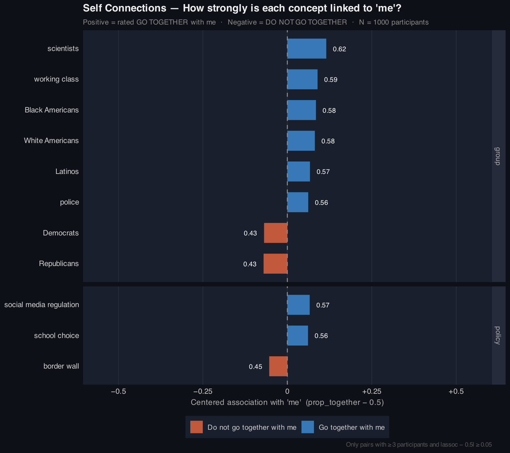
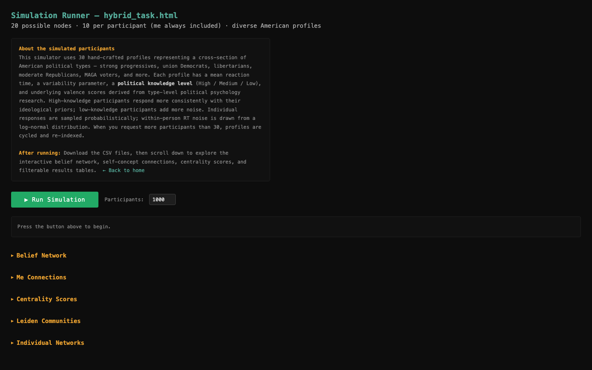

## What Is a Belief Network?

Belief-network theories (Brandt & Sleegers, 2021; Dalege et al., 2024; Goldberg & Stein, 2018; Galesic et al., 2021) treat a person's attitudes, group affiliations, and values not as a list of independent positions, but as a **network of mutually influencing concepts** — some beliefs are more central and load-bearing, others are peripheral. Whether a belief is stable or easily changed depends on how strongly, and how many other beliefs, it is tied to.

## How Belief Networks Are Usually Measured

Two dominant approaches, both built on explicit self-report:

- **Rating batteries.** Ask people to rate a fixed list of attitudes on Likert scales, then infer a network from correlations *across* many respondents — a population-level network, not a person-level one.
- **Pairwise conceptual-similarity judgments** (Brandt, 2022). Ask people directly how connected two concepts feel, for every pair in a fixed, researcher-chosen list — the closest prior tool to a true person-level network measure.

Both require the researcher to decide, in advance, exactly which concepts belong in the study.

## The Problem With That

- **Deliberation, not automaticity.** Ratings measure what people are willing to report, filtered through self-presentation — not what comes to mind first.
- **Social desirability.** Attitudes toward groups (race, party, class) are especially prone to editing before they reach the scale.
- **No confidence signal.** A slow, hesitant rating counts the same as a fast, confident one.
- **A fixed, researcher-chosen item set.** Both approaches fix the item list in advance — covered in more depth later.

Brandt (2022): belief-system structure research "is plagued by methodological shortcomings."

## Motivation: Building on Implicit Measurement

::: {.columns}
::: {.column width="50%"}
**Implicit Association Test**

Greenwald and colleagues showed that pairing concepts under time pressure and measuring response latency reveals associations people either don't report or can't report on surveys.

**Lodge & Taber — hot cognition**

"All sociopolitical concepts that have been evaluated in the past are affectively charged, and this affective charge is automatically activated within milliseconds on mere exposure to the concept" — faster than conscious appraisal (Lodge & Taber, 2005). Their broader *Rationalizing Voter* model argues citizens are "generally unable to reliably report their political beliefs, attitudes, and behavioral intentions" and that conscious deliberation is often more rationalizing than rational (Lodge & Taber, n.d.).
:::
::: {.column width="50%"}
**Brandt, Dalege, Galesic and colleagues**

Ideological belief systems function as networks of mutually reinforcing associations (Brandt & Sleegers, 2021; Dalege et al., 2024; Galesic et al., 2021) — some beliefs are more central and load-bearing than others.

**The gap**

No existing tool combines valence, pairwise association, *and* response time into a single task that outputs a full network per person or per sample.
:::
:::

## A Hybrid Two-Block Task

**Block 1 — Valence Evaluation**

Each concept (*Democrats, freedom, universal health care*...) appears alone. Participants classify it as **good** or **bad** within a 3s window. Key mapping (E/I) is counterbalanced across participants. Every node appears twice, across two sub-blocks.

**Block 2 — Pairwise Association**

Two concepts appear side-by-side. Participants judge whether they **go together** or **do not go together** within 4s. Every possible pair among a participant's 10 nodes is tested once; pairs involving *me* are tested twice.

Both blocks require a **mastery practice** first — 5 correct responses in a row on unambiguous stimuli (*world peace = good*, *fire + ice = apart*) — so slow or noisy responders are filtered before real trials begin.

## The Task, Live — Block 1

::: {layout-ncol=2}



:::

## The Task, Live — Block 2

::: {layout-ncol=2}



:::

Participants complete the task on any device — a mobile-optimized version auto-loads on touch screens.

## The Node-Selection Problem in Prior Work

Every network measure has to decide *which concepts to ask about* — and this has been the field's quiet bottleneck.

- **Fixed, researcher-chosen batteries.** Even Brandt's (2022) conceptual-similarity method — the closest prior tool to this one — asked about a fixed list negotiated in advance (e.g., "28 attitude pairs," with only "four attitudes common across studies"). Every participant answered about the *same* items, chosen because they fit the researcher's hypothesis.
- **Pre-specified questionnaires impose a belief count nobody asked for.** As Poulsen et al. (2025) put it, such designs "assume or impose the same number of beliefs on all participants, even when some participants might have never considered a particular belief before, or when some have many more or more nuanced beliefs than specified in the questionnaire."
- **The result:** the network you recover is shaped as much by what the survey designer decided to include as by what respondents actually believe — and it can't discover a connection the designer didn't think to ask about.

## How This Tool Answers It

Instead of one fixed battery, every participant sees **me** plus **9 nodes randomly drawn from a pool of ~23** spanning identity, policy, and values.

- **Breadth without asking everyone everything.** Across many participants the full pool gets covered — and every pair a person *does* see gets tested exhaustively, not cherry-picked.
- **No single hypothesis dictates the item set.** Because sampling is random rather than researcher-curated, no theoretical agenda determines which connections can even be observed.
- **Still not fully open-ended.** Unlike LLM-guided elicitation tools that let participants name their own beliefs in their own words (Poulsen et al., 2025), the pool itself is still investigator-defined. The gain here is breadth and randomization, not open elicitation — that tradeoff is discussed next.

## Random Assignment → Missing at Random

Every participant answers about only a fraction of the full concept pool. That looks like a missing-data problem — but the *randomness* of the assignment is what rescues it.

- **Planned, not incidental, missingness.** Each participant's 9 non-*me* nodes are drawn at random from the pool, so whether a given node or pair was *seen* is statistically independent of what that person's response to it *would have been*.
- **This licenses the MAR assumption.** Pooling `prop_good` / `prop_together` across whoever happened to see a given node or pair then yields unbiased population-level estimates — exactly as in planned-missingness ("matrix sampling") survey designs.

## MAR vs. Self-Selected Nodes

- **The alternative would break this.** If participants chose their own nodes to talk about, missingness would be *informative* — people raise what's salient to them — which is MNAR, not MAR.
- **That's a real tradeoff, not a flaw in either design.** Open elicitation (e.g., Poulsen et al.'s LLM-guided interviews, 2025) buys individual-level richness at the cost of population-level comparability across participants.
- **Bottom line:** randomization is what makes it valid to treat 1,000 partially-overlapping 10-node subgraphs as noisy observations of *one* underlying population network.

## What Gets Compared: The Node Pool

Every participant sees **10 nodes**: *me* (always included) plus 9 randomly sampled from a pool of concepts spanning three categories.

- **Identity (circle):** Democrats, Republicans, White/Black Americans, women, men, working/middle/poor class people
- **Policy (square):** Abortion access, same-sex marriage, capital punishment, tax cuts, minimum wage, health care, college athlete pay, disaster relief, AI regulation
- **Values (diamond):** Freedom, equality, tradition, security, compassion

## Step 1 — Valence Score

For each node, take the proportion of "good" responses (`prop_good`), then **down-weight it toward neutral if the response was slow** relative to that person's own typical speed. Fast responses signal more automatic, confident evaluation — exactly the logic behind IAT scoring and Lodge & Taber's (2005) finding that affectively congruent concepts produce faster reaction times.

RTs are log-transformed before anything else — they're right-skewed, and the field standard (Fazio, 1990, 1993; Bargh & Chartrand, 2000; Lodge & Taber, 2005) is to log first, not work on raw milliseconds:

```
# within-person, log-RT z-score — no arbitrary slope or floor
z            = (log(node_rt) - person_mean_log_rt) / person_sd_log_rt
rt_factor_b1 = 1 / (1 + exp(z))          # logistic squash

# 0 = strongly bad · 0.5 = neutral · 1 = strongly good
valence_centered = (prop_good - 0.5) * rt_factor_b1
valence_score     = 0.5 + valence_centered
```

At exactly the person's own average speed (z = 0) the factor is 0.5; faster than their own average pushes it toward 1, slower pushes it toward 0 — asymptotically, so no single trial is ever fully zeroed out.

## Step 2 — Association Strength

For every pair of nodes, take the proportion of participants who said "go together" and compute how far that is from indifference:

```
assoc_strength  = |prop_together - 0.5|
centered_assoc  = prop_together - 0.5   # keeps direction
```

A pair rated 0.9 "together" and a pair rated 0.1 "together" (i.e., strongly "apart") get the *same* strength — 0.4 — because both reflect a confident, non-neutral judgment. Direction is tracked separately so the network can distinguish cohesive ties from oppositional ones.

## Step 3 — RT-Weighted Edge Strength

Just as in Block 1, an edge's strength is discounted when the response was slow — a slow "together"/"apart" judgment is a weaker signal of a genuine automatic association. Same log + within-person z-score + logistic construction as Step 1:

```
# per participant x pair, then averaged across participants
z         = (log(pair_rt) - person_mean_log_rt) / person_sd_log_rt
rt_factor = 1 / (1 + exp(mean_z))
rt_weighted_strength = assoc_strength * rt_factor
```

`rt_weighted_strength` is the number that ultimately becomes each edge weight in the network — it is what the layout algorithm, the centrality scores, and the community detection all run on.

## Why Valence, Not Just Association?

An association graph alone can't tell you whether a tightly-linked cluster is a shared, positive in-group core or a shared, negative out-group target — the topology looks identical either way. Valence supplies the missing sign.

- **Hot cognition demands it.** If political concepts carry automatic affective charge the instant they're activated (Lodge & Taber, 2005), a map of *what connects to what* that ignores *how each node feels* is measuring only half of the automatic response.
- **Attitude-network models are built on signed nodes.** Formal accounts of belief systems (Dalege et al., 2024; Galesic et al., 2021) represent elements with both valence (an evaluative "field") and coupling (association strength) — dropping either term changes what the model can predict.
- **It gives centrality meaning.** A highly central *disliked* node (a polarizing hub) and a highly central *liked* node (a shared identity anchor) imply very different things about a belief system, even at identical centrality scores.

## From Edges to Structure

**Centrality** — computed on the weighted graph using `rt_weighted_strength` as edge weights:

- **Strength** — sum of incident edge weights (how connected overall)
- **Eigenvector** — connection to other well-connected nodes (hub-of-hubs)
- **Betweenness** — how often a node bridges other pairs

All normalized to [0,1] within the sample.

**Leiden community detection** — `igraph::cluster_leiden()` partitions the weighted network into cohesive belief clusters — modularity-optimal groupings of concepts that co-occur more than chance. A resolution (γ) sweep across ten values checks how stable those communities are as granularity changes.

## Network Layout

Nodes are placed with the **Fruchterman–Reingold** force-directed algorithm. Edges pull proportional to `rt_weighted_strength`, so fast, strongly-associated concepts cluster together spatially — not just in a similarity matrix, but visually. *Me* gets extra gravitational pull toward the center to make self-concept fusion legible at a glance.

- **Fill** = valence (dark red -> slate -> dark blue)
- **Stroke** = category (blue = identity, green = policy, purple = values)
- **Shape** = category (circle = identity, square = policy, diamond = values)
- **Size** = weighted centrality

## Output — The Full Belief Network

{fig-align="center" height="520"}

N = 1000 simulated participants · blue edges = "go together," orange/red = "do not go together"

## Output — Mean Valence per Concept

{fig-align="center" height="550"}

## Output — Subnetworks by Political Camp

{fig-align="center" height="480"}

The same procedure run separately within Liberal / Centrist / Conservative subsamples exposes different structural organization — not just different mean attitudes.

## Output — Networks by Political Knowledge (Simulated)

{fig-align="center" height="480"}

A simulated illustration — not real study data — of what the pipeline predicts: low-knowledge attitudes are less *crystallized* (compressed toward neutral, not just noisier), so Heider-balance associations stay closer to indifference and fewer survive the edge threshold. Independent measurement noise alone can't produce this; only this attitude-strength difference can.

## Output — Self-Concept Connections

{fig-align="center" height="550"}

Which concepts are fused with the self — the network's answer to "who am I, structurally?"

## Individual-Level Networks

Because every trial is logged per participant, the same pipeline that builds the population network also builds **one network per person**: their own 10 nodes, their own valence and association scores, their own RT weighting.

- Lets you compare belief-network topology *within* a person over time or conditions, not just between groups
- Surfaces individuals whose self-concept is fused to unexpected nodes (e.g., *me* strongly linked to *border wall*)
- Viewable interactively — drag, zoom, and pan each participant's graph in the results dashboard
- This is exactly the level theories of belief-system dynamics make predictions about, yet most measurement approaches only ever recover the population-level aggregate (Brandt, 2022; Poulsen et al., 2025)

## A Built-In Simulator

{fig-align="center" height="480"}

30 hand-crafted political profiles (progressives, union Democrats, libertarians, MAGA voters, etc.) with knowledge-scaled response noise — lets you stress-test the analysis pipeline before running real participants.
